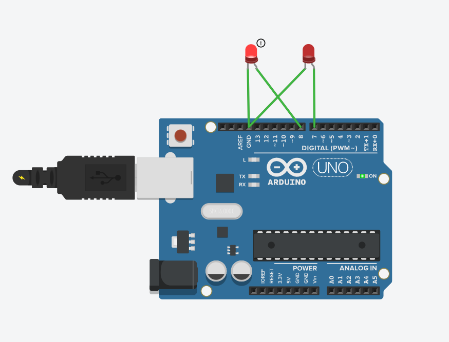

### Blink Left-Right 


```ino
int LeftLight = 8;
int RightLight= 7;

void setup()
{
  pinMode(LeftLight, OUTPUT);
  pinMode(RightLight, OUTPUT);
}

void loop()
{
  digitalWrite(LeftLight, HIGH);
  digitalWrite(RightLight, LOW);
  delay(1000); 
    digitalWrite(LeftLight, LOW);
  digitalWrite(RightLight, HIGH);
  delay(1000);  
}
```

