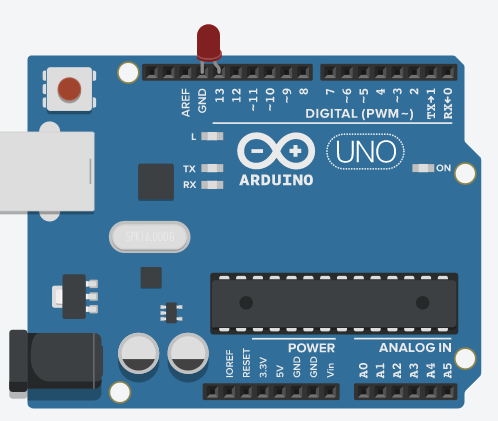

### Blink builtIn LED

>Second delay

```ino
void setup()
{
  pinMode(LED_BUILTIN, OUTPUT);
}

void loop()
{
  digitalWrite(LED_BUILTIN, HIGH);
  delay(1000); // Wait for 1000 millisecond(s)
  digitalWrite(LED_BUILTIN, LOW);
  delay(1000); // Wait for 1000 millisecond(s)
}
```

> turn on light for 1 second with 4 second delay

```ino
void setup()
{
  pinMode(LED_BUILTIN, OUTPUT);
}

void loop()
{
  digitalWrite(LED_BUILTIN, HIGH);
  delay(1000); // light on for 1 millisecond(s)
  digitalWrite(LED_BUILTIN, LOW);
  delay(4000); // off for 4(s)
}
```



